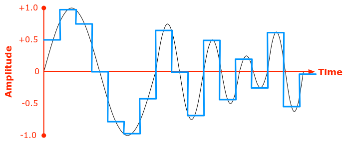

# video-calling

The goal of this project is to build a video calling software package from scratch. (Doing all the networking myself!)

I have achieved the audio part of this (having people on two computers talk to eachother). The video part has yet to be started.


## Sending Audio Between Computers [Done]

Sound travels as a wave, and can be represented as a function time vs amplitude for a given point in space. A computer samples this function at fixed intervals in time to get a digital representation of the sound as a function of time, as shown below.



I used the cpal rust package which takes a constant stream of these samples from your computers microphone, and stores them in either integer or floating point representations. 

The next challenge is sending this audio stream to the person you're making a call to. To achieve this, I made a custom packet for storing and sending these audio samples:

```
pub struct AudioPacket<S>
{
    pub maxbytes : usize, 
    pub timestamp : u128,
    pub sequencenumber : u32,
    pub samples : Vec<S>,
    pub bytes : Vec<u8>
}
```

It has various header information such as the number of bytes in the packet, the time it was sent, its sequence number relative to other packets, and the actual array of audio samples.

The other computer listens on a port for these packets which is buffers and plays on the speaker when it recieves enough.


## Challenges

I used UDP instead of TCP because it doesn't have as much overhead so is better for a time critical application like calling. This raises many issues however. One is that UDP does not guarentee a packet will reach its destination. I decided that it is acceptable to miss audio samples since a few of them will go unnoticed by users in the audio.
